# Stress Testing with Apache JMeter & BlazeMeter

Selamat datang di repositori proyek **Stress Testing**. Repositori ini berisi skenario dan skrip untuk pengujian performa menggunakan Apache JMeter, dengan bantuan ekstensi BlazeMeter untuk perekaman skenario.

## 1. Apa itu Apache JMeter?

**Apache JMeter** adalah perangkat lunak open-source berbasis Java yang sangat penting untuk melakukan pengujian beban (*load testing*). Alat ini mampu mensimulasikan sekelompok besar pengguna yang mengakses dan mengirimkan permintaan ke server target secara bersamaan.

Dengan menggunakan JMeter, kita dapat:
- Mengukur performa dan beban sistem (seperti waktu respons dan *throughput*).
- Mengidentifikasi hambatan (*bottlenecks*).
- Menguji skalabilitas dan kelemahan sistem sebelum aplikasi diluncurkan ke tahap produksi (*production*).

## 2. Apa itu Plugin BlazeMeter?

**BlazeMeter Chrome Extension** adalah alat bantu yang digunakan untuk merekam aktivitas di peramban (browser) dan mengubahnya secara otomatis menjadi skrip JMeter (.jmx). 

Dalam proyek ini, BlazeMeter digunakan untuk:
- Mempercepat proses pembuatan skrip pengujian tanpa harus menulis manual setiap request.
- Menangkap alur kerja pengguna (seperti login, navigasi menu, dan input data) secara akurat.
- Memberikan fleksibilitas dalam mengatur skenario sebelum diekspor ke JMeter.

## 3. Skenario Pengujian Performa

Repositori ini berisi skenario dan skrip untuk **Stress Testing** menggunakan Apache JMeter. Tujuan utama dari *Stress Testing* adalah untuk menguji dan menentukan batas atas (*upper limits*) dari performa, stabilitas, dan keandalan sistem saat ditekan dengan beban tinggi.

## 4. Panduan Langkah demi Langkah (Step-by-Step)

Berikut adalah urutan langkah yang dilakukan dalam proses pengujian ini:

### Langkah 1: Persiapan Plugin BlazeMeter
Gunakan ekstensi BlazeMeter di Chrome untuk mulai merekam skenario. Pastikan Anda sudah login untuk fitur ekspor yang lengkap.
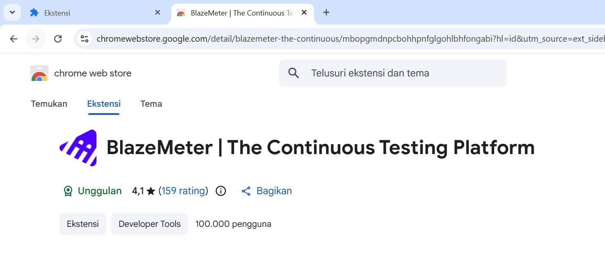

### Langkah 2: Konfigurasi Perekaman
Atur opsi perekaman, seperti menonaktifkan cache agar simulasi terasa seperti pengguna baru.
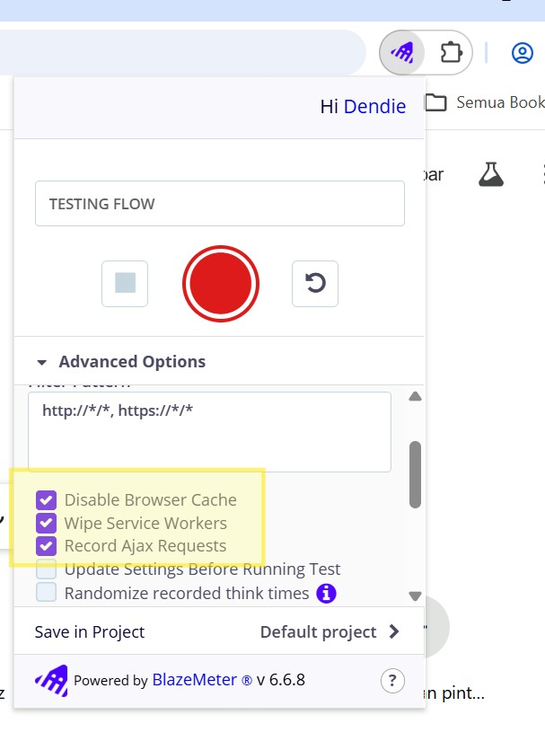

### Langkah 3: Login BlazeMeter
Pastikan Anda masuk ke akun BlazeMeter untuk mengunduh hasil rekaman dalam format JMX.
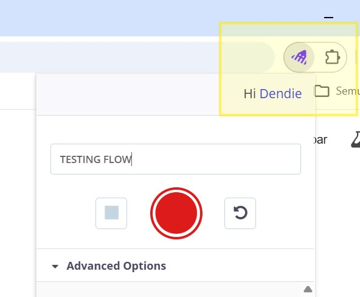

### Langkah 4: Mulai Perekaman (Start Record)
Tekan tombol 'Record' dan mulai jalankan skenario pada aplikasi target.
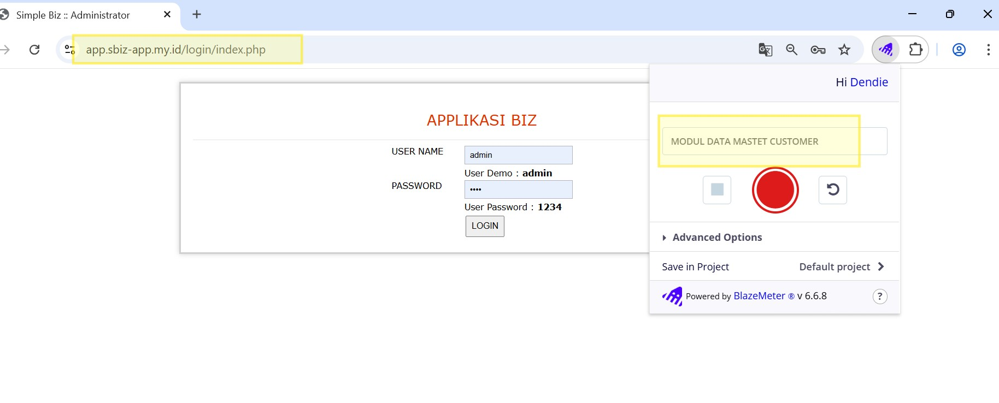

### Langkah 5: Tahap Login & Navigasi
Lakukan proses login dan mulai navigasi ke fitur yang ingin diuji, seperti menu Pelanggan.
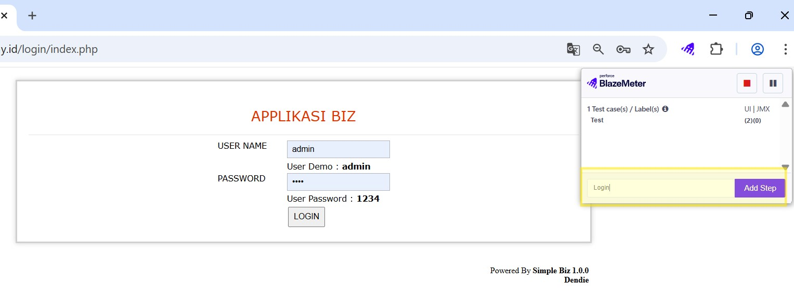
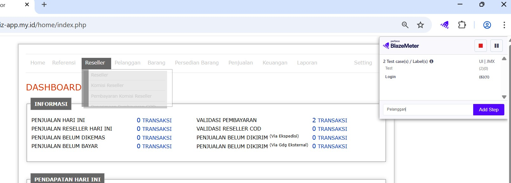

### Langkah 6: Aksi Input Data (Tambah & Edit)
Rekam aktivitas transaksi data seperti menambah atau mengubah data pelanggan.
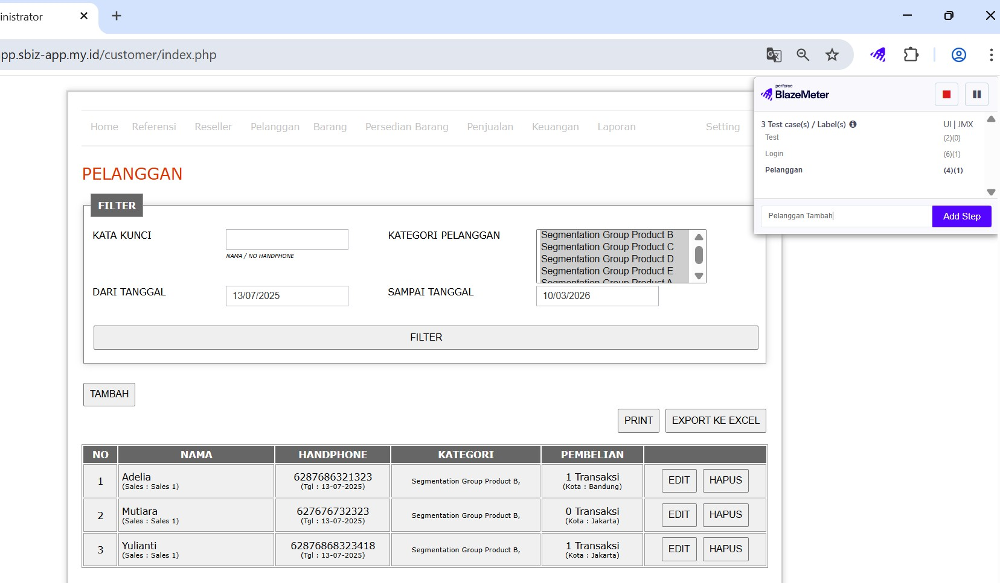
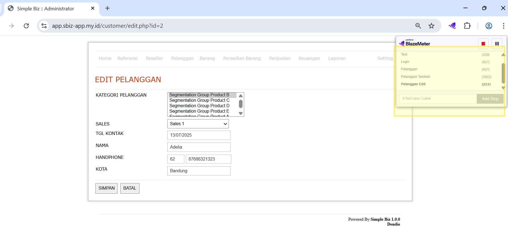

### Langkah 7: Berhenti & Ekspor ke JMX
Setelah skenario selesai, hentikan rekaman dan unduh file dalam format `.jmx` (JMeter).
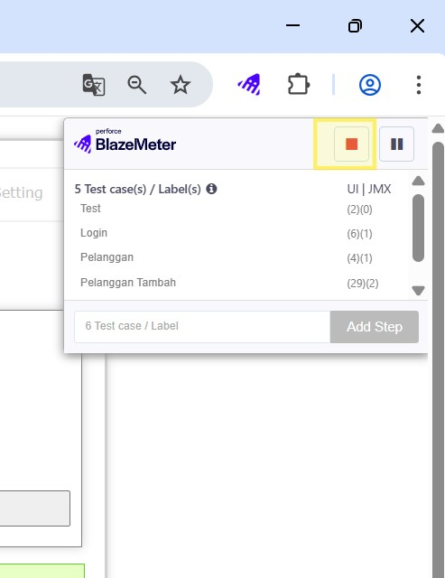
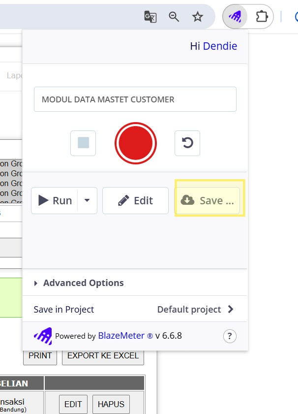
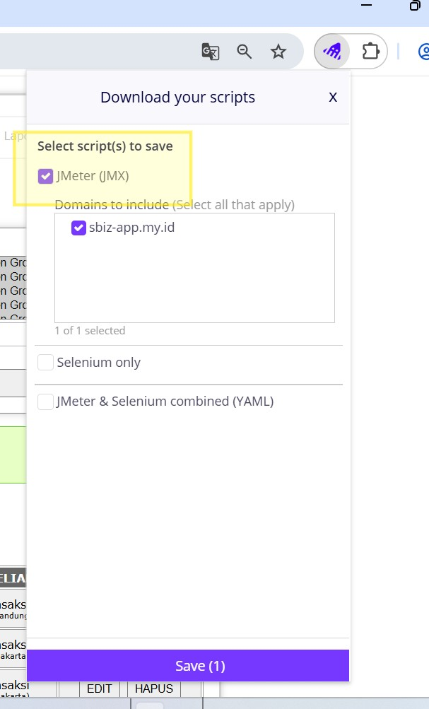
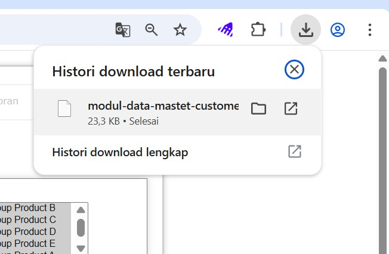

### Langkah 8: Membuka File di Apache JMeter
Buka aplikasi Apache JMeter dan muat file JMX yang sudah diunduh.
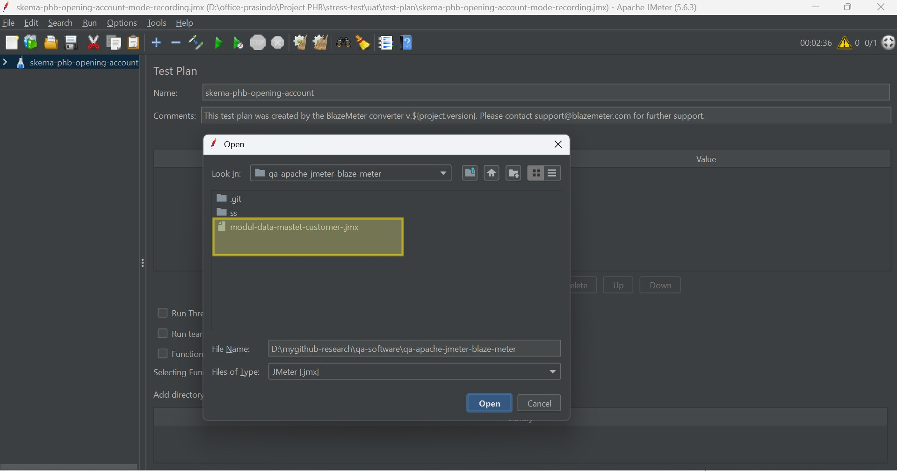

### Langkah 9: Review Skenario & Grouping
Lihat semua endpoint yang berhasil terekam dan pastikan sudah terkelompok dengan baik dalam Thread Group.
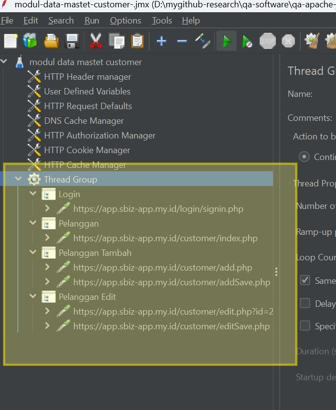

### Langkah 10: Pengaturan Timer & User Load
Atur jumlah pengguna (Threads) dan waktu jeda antar request (Timers) untuk mensimulasikan beban nyata.
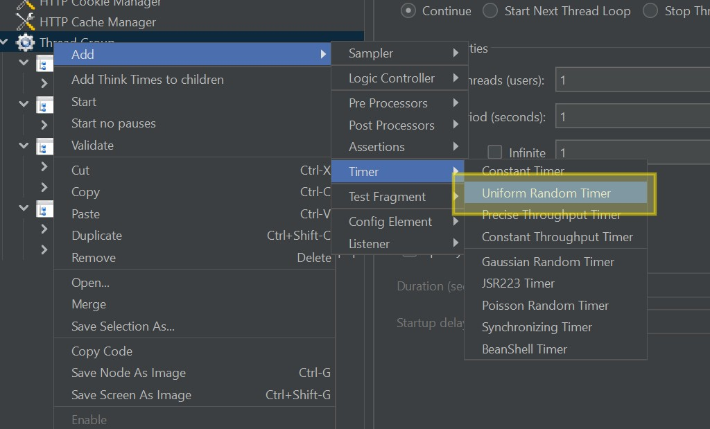
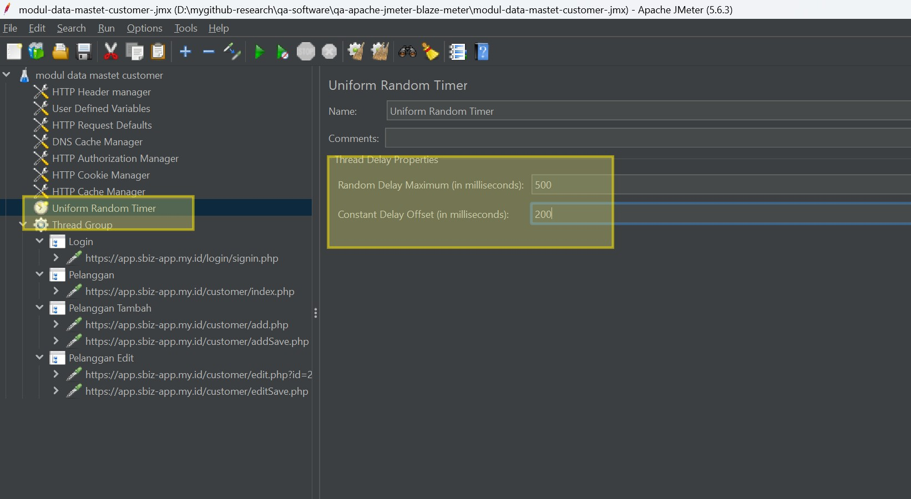

### Langkah 11: Menambahkan Listener (Hasil Pengujian)
Tambahkan *Listener* seperti *Aggregate Report* untuk melihat rangkuman hasil pengujian.
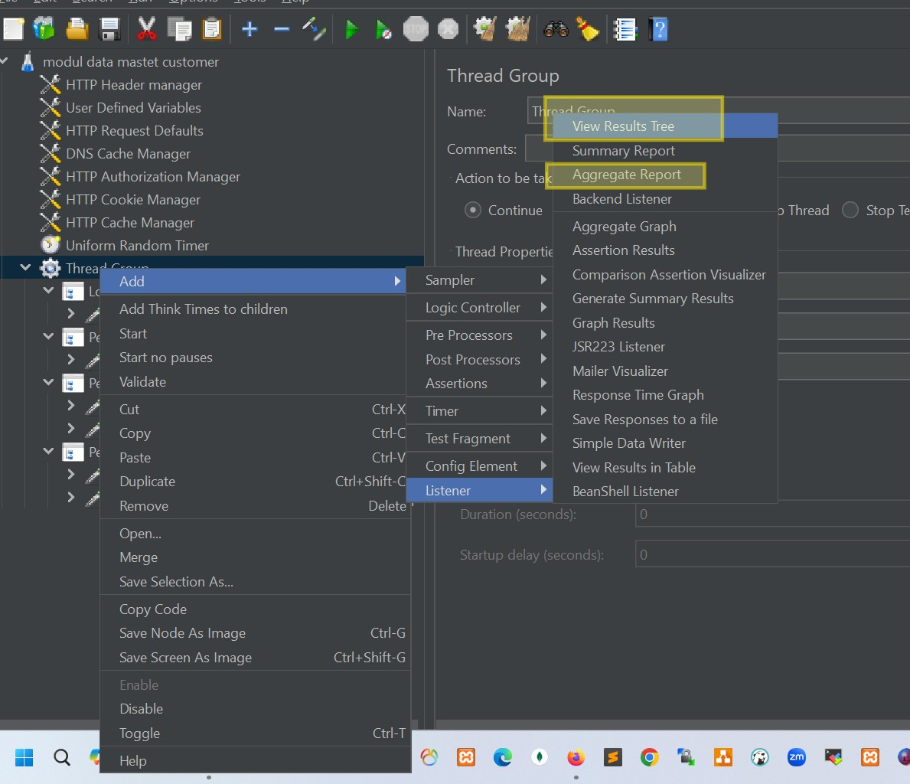

## 5. Download Apache JMeter

Anda dapat mengunduh versi terbaru Apache JMeter melalui tautan resmi berikut:
[Download Apache JMeter](https://jmeter.apache.org/download_jmeter.cgi)

